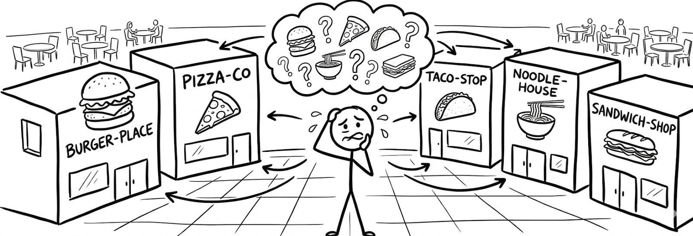

<h1 align="center">Sistema de Recomendación de Comida Rápida</h1>
 

*Este proyecto consiste en el desarrollo de un sistema de recomendación de comida rápida que **sugiere opciones personalizadas a los usuarios en función de sus preferencias.**
A partir del procesamiento de la información, el sistema busca identificar las mejores opciones disponibles considerando factores como precio, tipo de comida, gustos personales y restricciones alimenticias.*

## Problema
En la actualidad, los usuarios tienen **tantas opciones** de comida rápida lo cual hace que la toma de decisiones sea cada vez más complicada.
Además, muchas plataformas no personalizan adecuadamente las recomendaciones que hacen, ofreciendo opciones poco relevantes para cada usuario.

    

## Objetivo
Desarollar un sistema basado en la información de nuestros usuarios que permita **recomendar** opciones de comida rápida de forma **persnalizada**, optimizando la experiencia del usuario.

## Funcionamiento del Sistema
EL sistema opera mediante el siguiente flujo:

1. El usuario ingresa sus preferencias (tipo de comida, presupuesto, alergias, etc.)

2. El sistema accede a una base de datos de productos

3. Se aplican los filtros según las preferencias

4. Se calcula un puntaje para cada opción

5. Se genera un ranking con las mejores recomendaciones

    

## Datos que se utilizan

El sistema utiliza un conjunto de datos que incluye los siguientes campos:

| Atributo | Descripción |
| :--- | :--- |
| **Nombre del producto** | Nombre comercial del alimento. |
| **Categoría** | Clasificación (ej: hamburguesa, pizza, pollo, etc.). |
| **Calificación** | Puntaje o evaluación de los usuarios. |
| **Ingredientes** | Listado de componentes del producto. |
| **Información nutricional** | Detalles sobre calorías, grasas y valores nutricionales. |

## Metodología
El desarollo del sistema sigue el siguiente enfoque:
- Limpieza y preparación de datos
- Análisis exploratorio
- Filtrado basado en preferencias
- Sistema de puntuación y ranking

    

Se pueden aplicar técnicas como:

- Sistemas de recomendación basados en contenido
- Análisis de similitud

 ## Tecnologías
  Las herramientas propuestas para el desarollo incluyen:

 ## Resultados Esperados
  Se espera que:
  - Generar recomendaciones personalizadas
  - Mejorar la experiencia del usuario
  - Reducir el tiempo de decisión

 ## Autores
- Cardenas Castro, Kiary Danisha
- Bayona Vergara, Diego Alejandro
- Rivera Garzon, Luciana

<!-- Ejemplos -->

   
